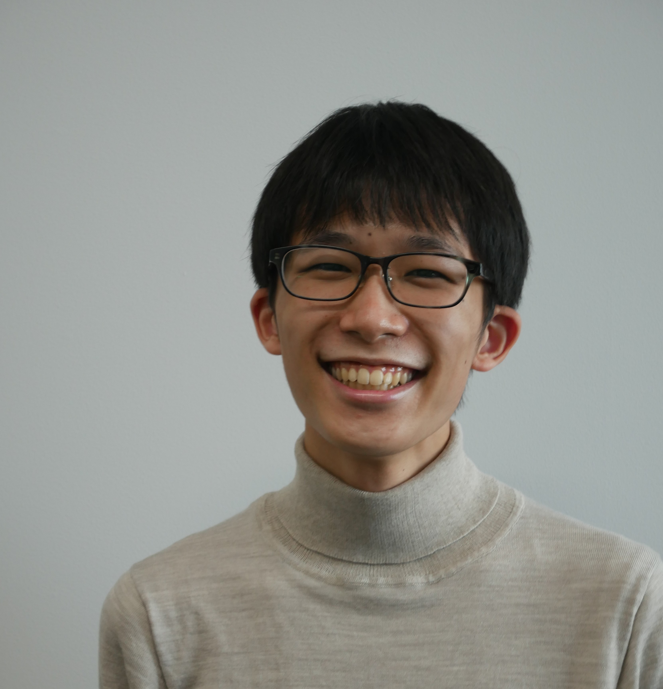

# About Me

- Kentaro Kawamura  (河村 健太郎)
- M.S. in Informatics
- Tokyo Denki Univerity
- Visual Perception & Recognition Laboratory by [Yuko Ozasa](https://researchmap.jp/yuko.ozasa?lang=en)
- https://033lab.org/
- **Links**: [Github](https://github.com/kawamura123)

# Research Interest
Key workds
- Computer Vision
- Machine Learning
- Hyperspectral Imaging
# Education
- 2023.04 - Present: M.S in Tokyo Denki University
- 2019.04 - 2023.03: B.S in Tokyo Denki University
# Awards (Japanese)
# Publications
## Domestic Conference (Japanese)
1. <u>河村健太郎</u>，小篠裕子，“ハイパースペクトル画像を用いた手の画素毎分類，”第26回 画像の認識・理解シンポジウム（MIRU），2023
2. <u>河村健太郎</u>，小篠裕子，“手画像のハイパースペクトル画素毎分類，” 電子情報通信学会 ISSジュニア＆学生ポスターセッション
3. <u>河村健太郎</u>，小篠裕子，“手のハイパースペクトル画像を用いた画素毎分類，”映像情報メディア学会冬季大会，2022
